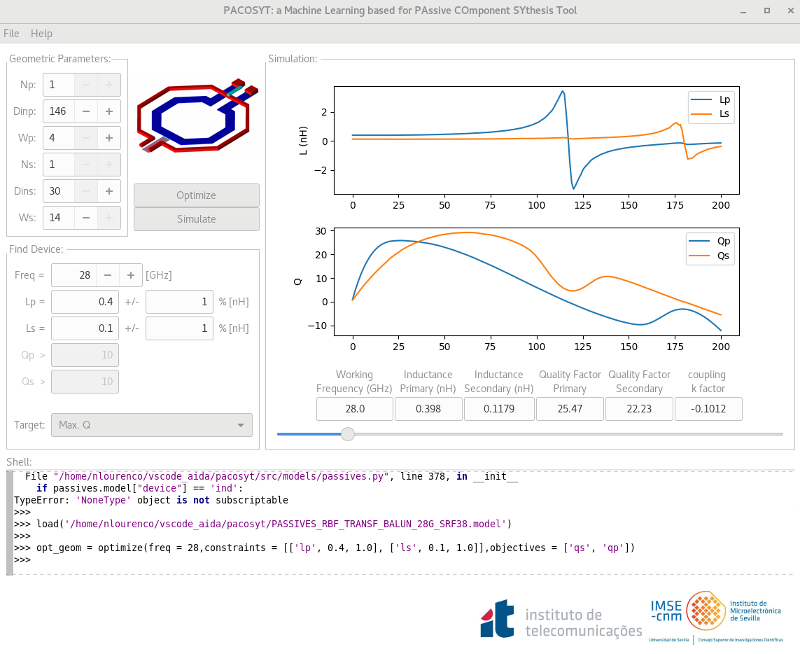

# PACOSYT: a ML based PAssive COmponent SYthesis Tool

## [Requirements](requirements.txt) 
pyhton 3.8.5

ipykernel==6.9.1 
pandas==1.4.1
scikit-learn==1.0.2
scipy==1.8.0
numpy==1.22.2
wxPython==4.1.1
matplotlib==3.5.1

*Only needed to run TMTT test code* 

tensorflow==2.8.0

## Download and Installation

Soon, pypy

## Quick Start
'''TBD'''

## Data Description
'''TBD'''

## TODOs
Formalize testing and CI 
Pypi packaging